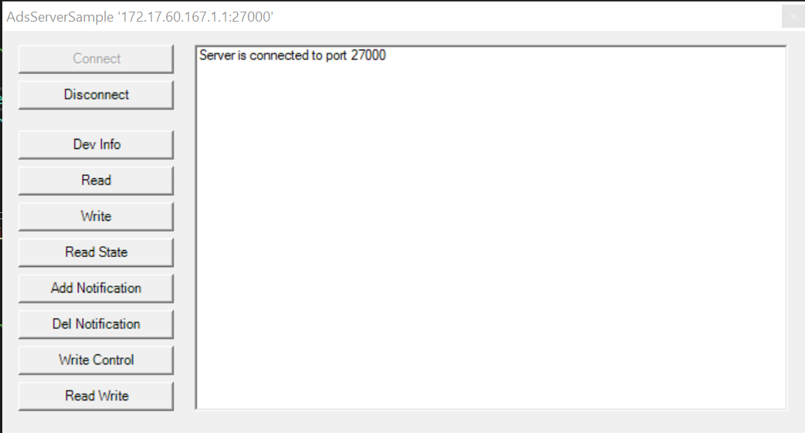

# Using of the AdsServerSample

The directory SampleServer contains Visual Studio projects with a sample implementation of an ADS server.

Open the solution file Test.AdsServerClr4.sln for the .NET 4 platform. The class AdsSampleServer implements a simple ADS server that is connected with a simple GUI.
Build and start the sample application.
The sample server can be controlled via the following GUI:



The first two buttons on the left control the connectivity of the server:

The Connect button connects the server to the fixed ADS port 27000. When the server is successfully connected, it is ready to answer ADS requests.
The Disconnect button disconnects the server an releases its ADS port.
The following buttons send ADS requests from the server. In this sample the server sends requests to itself. The requests are used to show how incoming responses can by handled in the overwritten confirmation methods of the server.

- Button Dev Info: Send an ADS Read Device Info Request.
- Button Read: Send an ADS Read Request.
- Button Write: Send an ADS Write Request.
- Button Read State: Send an ADS Read State Request.
- Button Add Notification: Send an ADS Add Device Notification Request
- Button Del Notification: Send an ADS Delete Device Notification Request
- Button Write Control: Send an ADS Write Control Request.
- Button Read Write: Send an ADS Read Write Request.


# Testing the AdsServerSample with a client

Run the AdsSymbolicServerSample application
The AmsPort is 27000. An easy way to test the server is using the
[**TcXaeMgmt** Powershell module](https://www.powershellgallery.com/packages/TcXaeMgmt).

Alternatively, an AdsClient application can be written with the
[Beckhoff.TwinCAT.Ads Package](https://www.nuget.org/packages/Beckhoff.TwinCAT.Ads/)
 that connects to the AmsNetId and port.

## Installing the **TcXaeMgmt** Powershell Module
If the **TcXaeMgmt** Module is not already existing on the system, it 
can be installed from the (Powershell Gallery)[https://www.powershellgallery.com]:

To test the availability:
```powershell
get-module TcXaeMgmt -listAvailable
```

The module is available in different flavours to support
- Windows Powershell >= 4.0
- Powershell (Core) >= 6.0

and different TwinCAT (Tc2 and Tc3) versions.  
<br>[TcXaeMgmt Package](https://www.powershellgallery.com/packages/TcXaeMgmt)  
[Beckhoff Documentation](https://infosys.beckhoff.com/content/1033/tc3_ads_ps_tcxaemgmt/3972231819.html?id=8731138690123386389)</br>

Please check the installation hints and install the module via PowershellGet Package Manager:
```powershell
PS> install-module TcXaeMgmt
PS> get-module TcXaeMgmt -listAvailable
```
## Testing the custom Ads Server **AdsSymbolServer**
### Testing the AdsServer
```powershell
test-adsroute -netId 172.17.60.167.1.1 -port 27000

Name                 Address           Port   Latency Result
                                               (ms)
----                 -------           ----   ------- ------
CX_1234              172.17.60.167.1.1 27000  18      Ok
```
### Getting AdsState
```powershell
 get-adsstate -netId 172.17.60.167.1.1 -port 27000

Name    State OK   Time (ms) Address
----    ----- --   --------- -------
CX_1234 Run   True 23        172.17.60.167.1.1:27000
```
